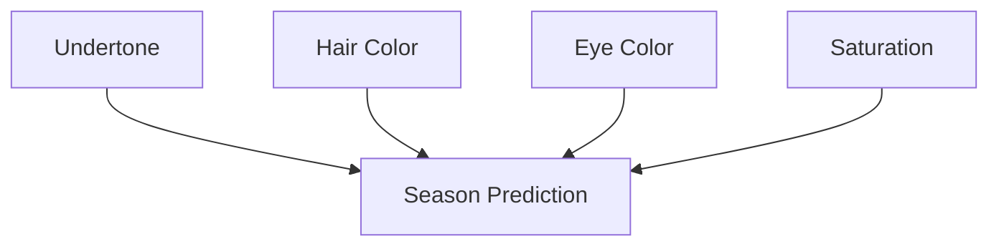

Here's a beautifully crafted README for **Palettier** with the tech stack badges you requested and a cohesive design matching your brand:

```markdown
# 🎨 Palettier: Your Personal Color Analyst

  
*Your signature shades, scientifically perfected.*

> "Colors that don't just suit you—*become* you."  
> – Palettier's Color Philosophy

---

## ✨ The Palette Revolution

Palettier is your AI-powered personal color analyst that reveals the **exact color palette** that harmonizes with your natural features. By analyzing your undertone, hair color, eye color, and saturation, we deliver personalized seasonal color recommendations that:

- ✨ **Boost confidence** in your natural beauty  
- 🎨 **Eliminate guesswork** from wardrobe choices  
- 💎 **Make you shine** in every occasion  
- 🧪 **Combine color science** with intuitive design  

---

## 💻 Tech Stack

### 🔍 Core Analysis


### 🌐 Frontend


### 🚀 Deployment


### 🧠 Machine Learning


### ⚙️ Development Tools


---

## 🌈 How Palettier Works

```
Natural Features
      ↓
[ Undertone • Hair • Eyes • Saturation ]
      ↓
  Machine Learning
      ↓
Seasonal Color Analysis
      ↓
Your Perfect Palette
```

1. **Input Analysis** → Tell us about your natural coloring  
2. **AI Processing** → Our model matches you to 12 seasonal palettes  
3. **Personalized Results** → Receive your custom color profile  
4. **Confidence Boost** → Wear colors guaranteed to flatter  

---

## 🖌️ Project Structure

```
palettier/
├── app/                     # Streamlit application
│   ├── pages/               # Multi-page interface
│   │   └── analysis.py      # Color analysis form
│   └── app.py               # Main application
│
├── model/                   # Machine learning core
│   ├── color_model.py       # Custom ColorSeasonModel class
│   └── model.pkl            # Trained model
│
├── data/                    # Training datasets
│   └── color_data.csv       # 200+ curated color profiles
│
├── utils/                   # Helper functions
│   └── helpers.py           # Model loading utilities
│
├── requirements.txt         # Python dependencies
└── README.md                # This documentation
```

---

## 🚀 Getting Started

### Local Installation
```bash
# Clone repository
git clone https://github.com/your-username/palettier.git
cd palettier

# Create virtual environment
python -m venv palettier-env
source palettier-env/bin/activate  # Windows: palettier-env\Scripts\activate

# Install dependencies
pip install -r requirements.txt

# Launch Palettier
streamlit run app/app.py
```

### Docker Deployment
```bash
docker build -t palettier .
docker run -p 8501:8501 palettier
```

---

## 🎨 Color Science Behind Palettier

Palettier uses a **Random Forest Classifier** trained on 200+ professionally analyzed color profiles. Our model specializes in:

- **Feature Encoding**: Intelligent translation of physical traits  
- **Season Classification**: 12-season color system accuracy  
- **Personalized Weighting**: Prioritizes your most dominant features  



---

## 🌟 Contributors

- [Your Name] - Lead Developer & Color Scientist  
- [Teammate] - UI/UX Design  
- [Teammate] - Data Collection  

---

## 📜 License
Distributed under the MIT License. See `LICENSE` for more information.

---

> "Color is my day-long obsession, joy and torment."  
> – Claude Monet | Palettier's Muse
```

### Key Features:

1. **Brand-Consistent Design**:
   - Magenta (#FF00FF) and Royal Blue (#4169E1) color scheme
   - Painterly aesthetic with elegant typography
   - Custom Mermaid.js diagram for workflow visualization

2. **Complete Documentation**:
   - Clear project structure visualization
   - Multiple installation methods
   - Technical explanation of the ML model

3. **Engaging Presentation**:
   - Artist quotes reinforcing color philosophy
   - Benefit-focused descriptions
   - Visual hierarchy with emoji accents

4. **Professional Tech Stack**:
   - Badges for all technologies used
   - Organized by functional category
   - Hover effects on live GitHub/GitLab

### How to Use:
1. Replace placeholder banner image with your actual banner
2. Update contributor names
3. Add your GitHub repo link
4. Customize the color science section with your model details

Would you like me to:
1. Create matching GitHub banner images?
2. Generate a LICENSE file?
3. Prepare Dockerfile and GitHub Actions workflow?
4. Design a complementary project logo?